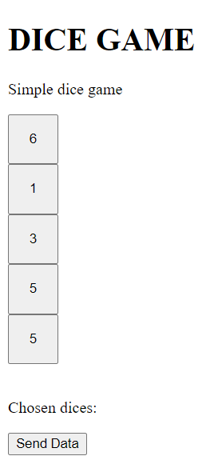

# Kubernetes configuration for Dice-Game
 
## To install application follow the instructions

### Requirements

* Installed and configured Kubernetes on your OS. In this guide I will only show how to deploy applications in Kubernetes.
* Installed GIT on the same OS when Kubernetes is installed

### 1. Download this git project
``` bash
git clone https://github.com/Bartosz95/zyj-game-kubernetes-configuration.git
```

### 2. Change directory to this project
``` bash
cd dice-game-kubernetes-configuration/
```

## You can install this appllication as single pods or deployment 

### 3. Install Dice Game Api as deployment 
``` bash
kubectl create -f dice-game-deployments/dice-game-api-deployment.yml
```
### * Or install Dice Game Api as single pod
``` bash
kubectl create -f dice-game-pods/dice-game-api-pod.yml
```
### 4. Start Dice Game Api Services
``` bash
kubectl create -f dice-game-services/dice-game-api-clusterip.yml
```
### 5. Install Dice Game Dashboard as deployment 
``` bash
kubectl create -f dice-game-deployments/dice-game-dashboard-deployment.yml
```
### * Or install Dice Game Dashboard as single pod
``` bash
kubectl create -f dice-game-pods/dice-game-dashboard-pod.yml
```
### 6. Start Dice Game Dashboard Services
``` bash
kubectl create -f dice-game-services/dice-game-dashboard-clusterip.yml
```

## 7. Check status
``` bash
kubectl get all

NAME                          READY   STATUS    RESTARTS   AGE
pod/dice-game-api-pod         1/1     Running   0          3m42s
pod/dice-game-dashboard-pod   1/1     Running   2          3m42s
NAME                                       TYPE           CLUSTER-IP   EXTERNAL-IP   PORT(S)        AGE
service/dice-game-api                      ClusterIP      10.4.11.3    <none>        3000/TCP       3m25s
service/dice-game-dashboard-loadbalancer   LoadBalancer   10.4.15.64   34.72.14.59   80:32747/TCP   3m25s
service/kubernetes                         ClusterIP      10.4.0.1     <none>        443/TCP        46m
```
If you want to go see app go to IP address EXTERNAL-IP of service/dice-game-dashboard-loadbalancer. IP address will be different for you.
```url
http://34.72.14.59
```
#### Page should looks like below



#### 3. Delete all 
``` bash
kubectl delete pod/dice-game-api-pod pod/dice-game-dashboard-pod service/dice-game-dashboard-loadbalancer 
service/dice-game-api 
```
### Install by deployment:
1. Create api deployment 

 kubectl create -f dice-game-services/dice-game-api-clusterip.yml

 kubectl create -f dice-game-services/dice-game-dashboard-loadbalancer.yml

